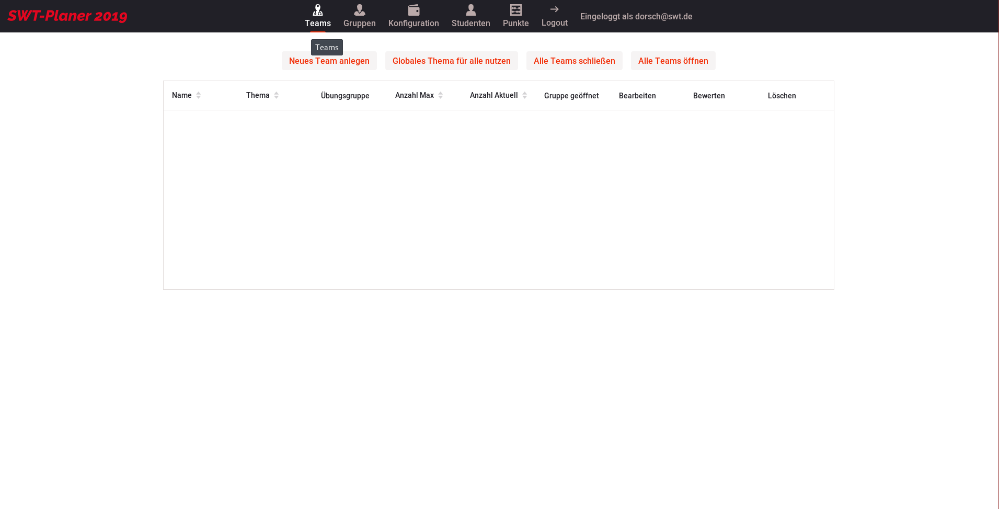

## SWT-Planer 2019 - Homework and Student Progress Tracking Software

This was our project for the Software Development course at University in 2019. We were an eight person team and had one semester to plan our software and one semester to implement it. We used **Java** in combination with **Spring Boot** for the backend and **Vaadin** for the frontend. In total there are over **6000** lines of code.

https://github.com/user-attachments/assets/679f90ca-25b0-4559-bc10-69d91c8956f5

